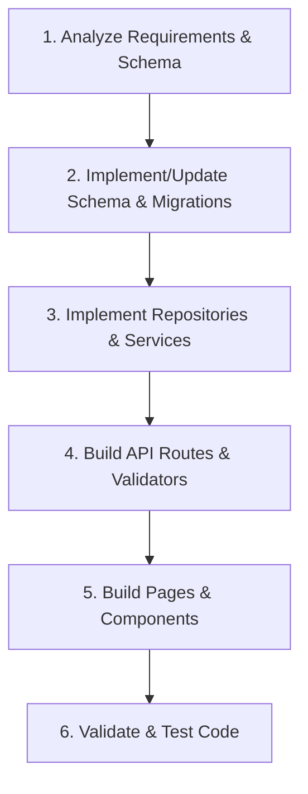

# Development Rules & Agent Skills

This document establishes the guidelines, constraints, and workflow patterns for developing and extending the **Home Visit Doctor Platform**. The AI agent must read and adhere to these rules for every task.

## 1. Core Principles

1. **Verify Before Coding**: Always read the database schema (`src/db/drizzle/migrations/schema.ts`) and active components before writing any logic.
2. **Preserve Existing Functionality**: Do not break or modify existing hospital assignment, doctor subscription, or hospital portal workflows.
3. **Database Integrity**: Never bypass check constraints or foreign keys. Keep status transitions aligned with defined enums.
4. **Strict RBAC**: Enforce Role-Based Access Control on every API and UI page. Patient pages/endpoints must check for the `'patient'` role.

---

## 2. Technical Standards

### 2.1 Database (Drizzle ORM) & Layered Architecture
- Use standard Drizzle syntax for all queries and schema updates.
- Keep table definitions consistent with the generated migrations.
- When referencing user roles, ensure they are validated against the `users_role_check` constraint.
- **Repository Layer Constraint**: Repository files (located in `/lib/repositories/`) must strictly contain *only* low-level database operations and raw/SQL/Drizzle queries. They must never contain business logic.
- **Service Layer Constraint**: Service files (located in `/lib/services/`) must contain all business logic, validation, orchestrations, and rules.
- **Transaction Boundaries**: If a business flow requires performing more than one database write/update operation, those operations *must* be wrapped within a single atomic database transaction boundary (e.g. `db.transaction(...)`) to prevent partial writes/data corruption on failure.
- **CTE Approach for Complex Updates**: For complex, multi-stage database writes, cascading state changes, or bulk updates, prefer SQL Common Table Expressions (CTEs) in raw queries or Drizzle query blocks. This keeps the execution atomic and reduces application-database network round-trips.

### 2.2 Frontend (Next.js 15 App Router & Tailwind CSS)
- Follow the existing folder structure under `/app` (App Router pages, layouts, templates).
- Use Tailwind CSS and shadcn/ui components for UI styling. Make interfaces look premium, responsive, and modern.
- Keep components focused, reusable, and type-safe.

### 2.3 Backend & API
- API routes must be located under `app/api/`.
- Validate all request payloads using Zod schemas.
- Return structured JSON responses with appropriate HTTP status codes:
  - `200 OK` / `201 Created` for success
  - `400 Bad Request` for validation/input errors
  - `401 Unauthorized` / `403 Forbidden` for auth/role failures
  - `404 Not Found` for missing resources
  - `500 Internal Server Error` for system crashes

---

## 3. Development Workflow

For every new feature or module:

### Step 1: Analyze Requirements
- Review `docs/home-visit-prd.md` to ensure the work matches the current Release 1 Version 1.0 scope.

### Step 2: Database Layer
- Declare new tables, check constraints, and column additions in the schema file.
- Verify migrations run successfully before moving to business logic.

### Step 3: Service Layer
- Implement queries and data access inside the `/lib/repositories` or `/lib/services` directories.

### Step 4: API Layer
- Implement backend API routes under `app/api/` with type-safe handlers and validation guards.

### Step 5: UI & Page Layer
- Build responsive, interactive pages under `app/patient/` or `app/doctor/` as required.

### Step 6: Verification
- Verify the build compiles without TypeScript or linting errors.
