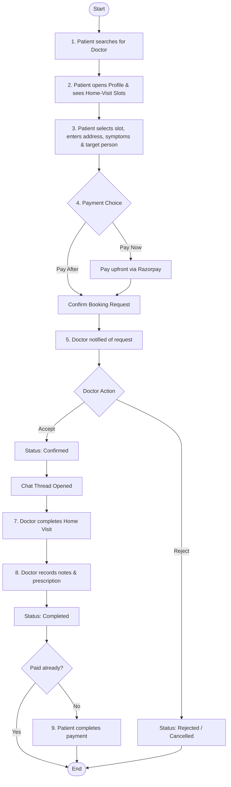

# Home Visit Doctor Platform Product Requirements Document

**Release 1 — Version 1.0**  
**Date:** 26 July 2026  
**Status:** Approved for Release 1 Build  

---

> [!NOTE]
> This document defines the feature set for Release 1 of the Home Visit Doctor platform. It covers the complete workflow for a patient to find a doctor, book a home visit, pay, and receive a prescription, along with the supporting doctor and admin capabilities needed to run it.

---

## 1. Purpose of This Document

This document acts as the single source of truth for the Release 1 scope of the Home Visit Doctor Platform. All secondary phases and features from previous drafts have been deferred to prioritize a streamlined, end-to-end patient care experience.

---

## 2. Core Flow

Below is the step-by-step patient and doctor workflow:

1. **Search**: Patient searches for a doctor by specialty, location, or name.
2. **Availability**: Patient opens the doctor's profile and sees available home-visit slots.
3. **Details**: Patient selects a time inside an available slot, enters address, symptoms, and specifies who the visit is for.
4. **Checkout**: Patient chooses to pay now or pay after the visit, and confirms the booking request.
5. **Approval**: Doctor is notified and accepts or rejects the request.
6. **Confirmation**: If accepted, booking moves to **Confirmed** and a chat thread opens between the doctor and patient.
7. **Visit**: Doctor completes the home visit.
8. **Documentation**: Doctor records visit notes and prescription (either typed directly or uploaded as a scanned file/photo), and the booking status moves to **Completed**.
9. **Finalization**: Patient views/downloads the notes and prescription, and completes the payment if not already paid upfront.

### 2.1 Core Flow Visualization

---

## 3. Patient-Side Features

| Feature ID | Feature | Detail |
| :--- | :--- | :--- |
| **PAT-01** | Account creation | Email/phone + password signup. Basic profile: name, phone, email. |
| **PAT-02** | Doctor search | Search by specialty, location, or doctor name. Plain results list — no filters or sorting. |
| **PAT-03** | Doctor profile | Name, specialty, fee, photo, home-visit availability status. |
| **PAT-04** | Booking | Book for self or another person (typed in at booking, no saved profiles). Enter address and symptoms as free text. Pick a time inside the doctor's home-visit tagged availability slot. |
| **PAT-05** | Booking status | Lifecycle: `Requested` &rarr; `Confirmed` &rarr; `Completed` &rarr; `Cancelled`/`Rejected`. |
| **PAT-06** | My Bookings | Patient sees all upcoming and past bookings with current status. |
| **PAT-07** | Payment | Paid to the platform, not directly to the doctor. Patient may pay upfront at booking or after the visit is completed. Online payment via Razorpay. |
| **PAT-08** | Payment history | Patient sees past payments/invoices against each booking. |
| **PAT-09** | Visit notes & prescription | Patient can view and download the doctor's notes and prescription from the booking detail page. |
| **PAT-10** | Chat | Basic text chat with the doctor, automatically created once a booking is confirmed. |
| **PAT-11** | Notifications | One event only: booking confirmed, sent by email/push. |
| **PAT-12** | Cancellation | Simple rule: cancel before the visit &rarr; refunded. Cancel after the visit &rarr; not refunded. |

---

## 4. Doctor-Side Features

> [!TIP]
> **Scheduling Efficiency:** Home-visit scheduling reuses the doctor's existing availability feature (already used for hospital assignments) rather than introducing a new scheduling model. This keeps build cost low and behavior familiar to doctors already on the platform.

| Feature ID | Feature | Detail |
| :--- | :--- | :--- |
| **DOC-01** | Home Visit toggle | Doctor turns home-visit availability on or off. When off, doctor does not appear in home-visit search. |
| **DOC-02** | Availability / slots | Reuses the doctor's existing Schedule feature (already used for hospital assignments). One new field is added to slot creation: *“This slot is for: Hospital / Home Visit.”* A slot is tagged one or the other, never shared — this avoids any double-booking logic. |
| **DOC-03** | Booking requests | Doctor is notified when a patient books inside a home-visit slot, and can Accept (&rarr; `Confirmed`) or Reject (&rarr; `Cancelled`, patient notified). |
| **DOC-04** | Visit documentation | After the visit, doctor records notes and prescription by typing, or alternatively uploads a photo/scanned file if typing is inconvenient. |
| **DOC-05** | Fee | Set by admin, not the doctor. Doctor sees the fee on their profile but cannot edit it. |
| **DOC-06** | Chat | Doctor can chat with confirmed patients using the same chat feature. |

---

## 5. Admin Features

> [!IMPORTANT]
> A minimal admin capability is required in this release — primarily because doctor fees are set by the platform, not the doctor, which needs an admin-side control.

| Feature ID | Feature | Detail |
| :--- | :--- | :--- |
| **ADM-01** | Doctor onboarding | Admin approves a doctor before they appear in search. |
| **ADM-02** | Fee management | Admin sets and edits each doctor's home-visit consultation fee. |
| **ADM-03** | Booking oversight | Admin can view all bookings across the platform. |
| **ADM-04** | Payment oversight | Admin can view all payments collected by the platform. |

---

## 6. Platform Baseline

| Feature ID | Feature | Detail |
| :--- | :--- | :--- |
| **BASE-01** | Security | Role-based access control, encryption of data at rest and in transit, audit log of key actions, one consent checkbox at signup. |
| **BASE-02** | Maps | Address is converted to latitude/longitude for storage only. No ETA, live tracking, or route optimization in this version. |
